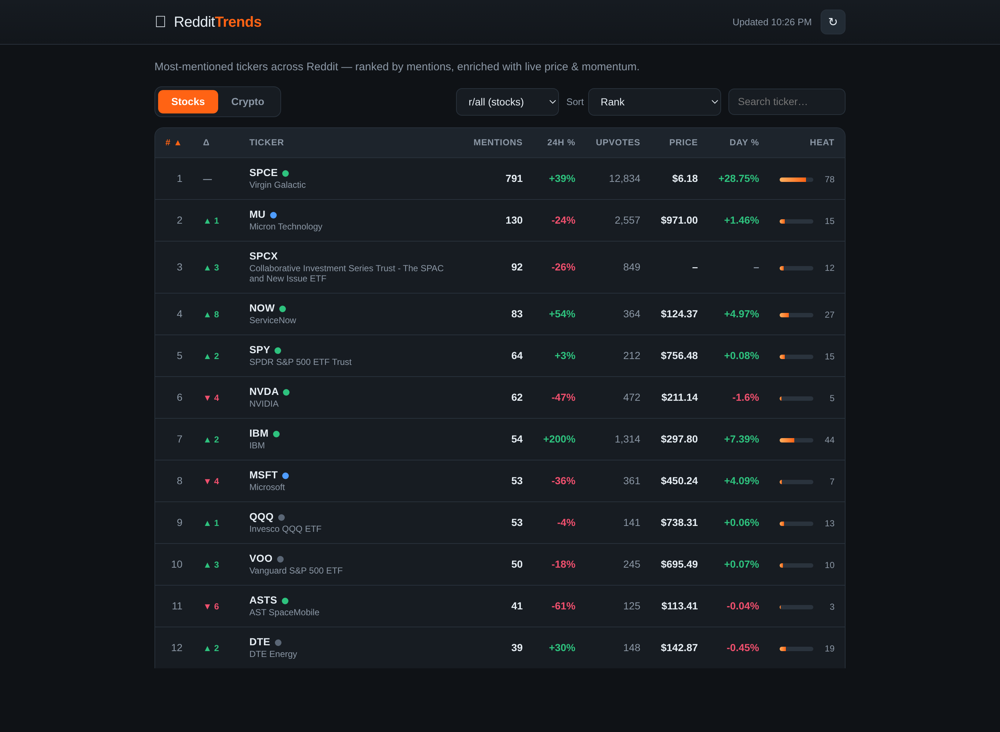

# RedditTrends

RedditTrends shows which stock and crypto tickers people are talking about most
on Reddit. It's modeled on [ApeWisdom](https://apewisdom.io/): it counts
mentions, ranks them, tracks how each ticker moves over 24 hours, and pulls in
live prices so you can see when the chatter and the price line up or pull apart.



## What you get

- A ranked table of trending tickers, with mentions, 24h rank change, upvotes,
  live price, day move, and a Heat bar that blends mentions and momentum.
- Live prices with no API key. Stocks come from Stooq, crypto from CoinGecko.
- A divergence flag that points out when mentions and price disagree, like
  chatter climbing while the price drops.
- Stocks and Crypto tabs, each filterable by subreddit (wallstreetbets, stocks,
  CryptoCurrency, and more).
- Click any ticker for a detail view with about a dozen stats and charts for
  mentions and price.
- Optional Telegram alerts when a ticker's mentions suddenly spike (see below).

## Run it

You need Node 18 or newer (the `.nvmrc` pins Node 20).

```bash
cd reddit-trends
nvm use
npm install
npm start
```

Then open http://localhost:4000.

## Where the data comes from

The app tries three sources, in order, and uses the first one that's available:

1. Your own Reddit pipeline, if you've set up `credentials.json` (optional,
   covered below).
2. The free ApeWisdom public API. No key, no signup. This is the default and
   gives you real numbers right away.
3. Built-in sample data, so the page is never empty if the others are down.

Prices are layered on top no matter which mention source is used, and everything
fails quietly: if a price source can't be reached, those cells just stay blank.

A quick note on why it doesn't read Reddit directly: Reddit blocks anonymous
scraping, and getting API access now means filling out their Data API form.
ApeWisdom skips all of that, which is why it's the default here.

## Telegram spike alerts (optional)

If you want a heads-up when a ticker starts blowing up, the app can watch for it
and message you on Telegram. It measures how fast a ticker's mention count is
climbing, compares that to the ticker's own normal pace, and only pings you on
real outliers. Each alert also notes whether price and volume back up the move.
You turn it on with a few environment variables (a Telegram bot token, the chat
to post to, and the thresholds you want). See DEPLOY.md for the details.

## Run your own Reddit pipeline (optional)

This uses Reddit's app-only login, so it never touches your Reddit password,
just a client id and secret.

1. Open https://www.reddit.com/prefs/apps and create an app.
2. Choose the "script" type. Use http://localhost:4000 as the redirect uri
   (it's required but not actually used).
3. Copy `credentials.example.json` to `credentials.json` and paste in your
   client id and secret. That file is gitignored.
4. Restart with `npm start`. You should see a line confirming Reddit OAuth is
   configured.

Heads up: this now requires completing Reddit's Data API registration.

## Project layout

```
src/         TypeScript source: server, data sources, aggregation, store
src/client/  browser UI, compiled to public/app.js
public/      index.html, styles, and the compiled client
data/        the SQLite database (created on first run, gitignored)
```

It's written in TypeScript. `npm install` builds it for you; run `npm run build`
to rebuild after you change something.

## Deploying

To keep history building around the clock, run the collector on a schedule with
cron or a systemd timer. DEPLOY.md has a full Raspberry Pi walkthrough.

Not investment advice.
